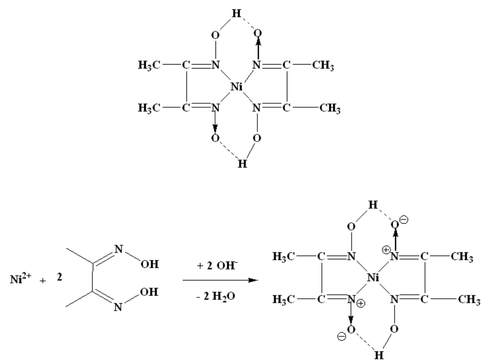
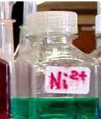
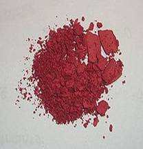
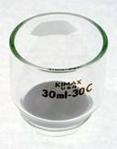

## Theory

<strong>Gravimetric analysis</strong> is one of the most accurate analytical methods available. It is concerned with the determination of a substance by the process of weighing. The element or radical to be determined is converted into a stable compound of definite composition and the mass of the compound is determined accurately. From this, the mass of element or radical is calculated.

The gravimetric analysis involves:

<ul>
  <li>Precipitation</li>
  <li>Filtration</li>
  <li>Washing of the precipitate</li>
  <li>Drying, ignition and weighing of the precipitate</li>
</ul>

<strong>Following are the four fundamental types of gravimetric analysis:</strong>

<ul>
  <li>Physical gravimetry</li>
  <li>Thermogravimetry</li>
  <li>Precipitative gravimetric analysis</li>
  <li>Electrodeposition</li>
</ul>

These differ in the preparation of the sample before weighing of the analyte.

<h4>Physical gravimetry:</h4>

Physical gravimetry involves the physical separation and classification of matter in environmental samples based on volatility and particle size (e.g., total suspended solids). It is the most common type used in environmental engineering.

<h4>Thermogravimetry:</h4>

In this method the samples are heated and the changes in sample mass are recorded. Volatile solid analysis is an important example for this type of gravimetric analysis.

<h4>Precipitative gravimetry:</h4>

The chemical precipitation of an analyte occurs in the precipitative gravimetry. The most important application of this technique in the environmental field is the analysis of sulphite.

<h4>Electrodeposition:</h4>

It involves the electrochemical reduction of metal ions at a cathode and simultaneous deposition of the ions on the cathode.

<h4>The steps commonly followed in gravimetric analysis are:</h4>
<ol>
  <li>Preparation of a solution containing a known weight of the sample.</li>
  <li>Separation of the desired constituent.</li>
  <li>Weighing the isolated constituent.</li>
  <li>Computation of the amount of the particular constituent in the sample from the observed weight of the isolated substance.</li>
</ol>

<h3>Pecipitative Gravimetric Analysis:</h3>

Precipitative gravimetric analysis requires that the substance to be weighed be readily removed by filtration. In order for a non-filterable precipitate to form, it must be supersaturated with respect to its solubility product constant. However, if it is too far above the saturation limit, crystal nucleation may occur at a rate faster than crystal growth (the addition of molecules to a crystal nucleus, eventually forming a non-filterable crystal). When this occurs, numerous tiny micro-crystals are formed rather than a few large ones. In the extreme case, micro-crystals may behave as colloids and pass through a fibrous filter. To avoid this, precipitating solutions may be heated. Because the solubility of most salts increases with increasing temperature, this treatment will lower the relative degree of super saturation and slow the rate of nucleation. Also, one might add the precipitant slowly with rapid mixing to avoid the occurrence of locally high concentrations.

Precipitative gravimetry is often practiced at high ionic strengths. This is to reduce the electric double layer thickness (salting-out effect) of the slowly forming crystals. When this occurs, electrostatic repulsion between the crystal and its precipitating molecules is reduced. Crystal growth can then occur more rapidly. It is very important that the precipitate be pure and has the correct stoichiometry.

<h3>Co-precipitation:</h3>

For certain gravimetric analysis some other substances besides the desired substances also get precipitated in small amounts, the phenomenon is called co-precipitation. It occurs when an unwanted ion or molecule becomes trapped in the precipitate. This may be due to inclusion or occlusion. Inclusion is the term used for a single substitution in the crystal lattice by an ion of similar size. Occlusion refers to the physical trapping of a large pocket of impurities within the crystal. One technique for minimizing these problems is to remove the mother liquor, re-dissolve the precipitate and then re-precipitate. The second time the mother liquor will contain fewer unwanted ions capable of co-precipitation.

<h3>Conditions of Precipitation:</h3>
<ol>
  <li>Precipitation should be carried out in dilute solutions.</li>
  <li>The reagents should be mixed slowly and with constant stirring. This will assist the growth of large crystals.</li>
  <li>Precipitation is effected in hot solutions, provided the solubility and stability of the precipitate permit it. Either one or both of the solutions should be heated to just below the boiling point. High temperature assists:
    <ul>
      <li>Coagulation</li>
      <li>Increased velocity of crystallization</li>
    </ul>
  </li>
  <li>Crystalline precipitates should be digested for as long as possible, preferably overnight.</li>
</ol>

<h3>Precipitating Reagents:</h3>

Ideally a gravimetric precipitating agent should react specifically or at least selectively with the analyte. Specific reagents which are rare, react only with a single chemical species. Selective reagents which are more common, react with a limited number of species. In addition to specificity and selectivity, the ideal precipitating reagent would react with analyte to give a product that is:

<ul>
  <li>Easily filtered and washed free of contaminants</li>
  <li>Of sufficiently low solubility that no significant loss of the analyte occurs during filtration and washing</li>
  <li>Unreactive with constituents of atmosphere</li>
  <li>Of known chemical composition after it is dried or, if necessary, ignited</li>
</ul>

Most of the inorganic ions have yielded to gravimetric analytical techniques, but one finds many interfering ions. The table below illustrates both the abundance of reagents available for use as well as the problems which can be encountered by interfering ions:

<table cellpadding="5" cellspacing="0">
  <thead>
    <tr>
      <th>Analyte</th>
      <th>Precipitate</th>
      <th>Measured form</th>
      <th>Interferences</th>
    </tr>
  </thead>
  <tbody>
    <tr><td>K+</td><td>KB(C6H5)4</td><td>KB(C6H5)4</td><td>NH4+, Ag+, Hg2+, Tl+, Rb+, Cs+</td></tr>
    <tr><td>Mg2+</td><td>Mg(NH4)PO4·6H2O</td><td>Mg2P2O7</td><td>Many metals (none from Na+ and K+)</td></tr>
    <tr><td>Ca2+</td><td>CaC2O4·H2O</td><td>CaCO3 or CaO</td><td>Many metals (none from Mg2+, Na+ and K+)</td></tr>
    <tr><td>Ba2+</td><td>BaSO4</td><td>BaSO4</td><td>Na+, K+, Li+, Ca2+, Al3+, Cr3+, Fe3+, Sr2+, Pb2+</td></tr>
    <tr><td>Ti4+</td><td>TiO(5,7-dibromo-8-hydroxyquinoline)2</td><td>TiO(5,7-dibromo-8-hydroxyquinoline)2</td><td>Fe3+, Zr4+, Cu2+, C2O42−, citrate, HF</td></tr>
    <tr><td>VO43−</td><td>Hg3VO4</td><td>V2O5</td><td>Cl−, Br−, I−, SO42−, CrO42−, AsO43−, PO43−</td></tr>
    <tr><td>Cr3+</td><td>PbCrO4</td><td>PbCrO4</td><td>NH4+, Ag+</td></tr>
    <tr><td>Mn2+</td><td>Mn(NH4)PO4·H2O</td><td>Mn2P2O7</td><td>Interferences from numerous metals</td></tr>
    <tr><td>Fe3+</td><td>Fe(HCO2)3</td><td>Fe2O3</td><td>Interferences from numerous metals</td></tr>
    <tr><td>Co2+</td><td>Co(1-nitroso-2-naphtholate)3</td><td>CoSO4 (by reaction with H2SO4)</td><td>Fe3+, Zr4+, Pd2+</td></tr>
    <tr><td>Ni2+</td><td>Ni(dimethylglyoximate)2</td><td>Ni(dimethylglyoximate)2</td><td>Pd2+, Pt2+, Bi3+, Au3+</td></tr>
    <tr><td>Cu2+</td><td>CuSCN</td><td>CuSCN</td><td>NH4+, Pb2+, Hg2+, Ag+</td></tr>
    <tr><td>Zn2+</td><td>Zn(NH4)PO4·H2O</td><td>Zn2P2O7</td><td>Interferences from numerous metals</td></tr>
    <tr><td>Ce4+</td><td>Ce(IO3)4</td><td>CeO2</td><td>Th4+, Ti4+, Zr4+</td></tr>
    <tr><td>Al3+</td><td>Al(8-hydroxyquinolate)3</td><td>Al(8-hydroxyquinolate)3</td><td>Interferences from numerous metals</td></tr>
    <tr><td>Sn4+</td><td>Sn(cupferron)4</td><td>SnO2</td><td>Cu2+, Pb2+, As(III)</td></tr>
    <tr><td>Pb2+</td><td>PbSO4</td><td>PbSO4</td><td>Ca2+, Sr2+, Ba2+, Hg2+, Ag+, HCl, HNO3</td></tr>
    <tr><td>NH4+</td><td>NH4B(C6H5)4</td><td>NH4B(C6H5)4</td><td>K+, Rb+, Cs+</td></tr>
    <tr><td>Cl−</td><td>AgCl</td><td>AgCl</td><td>Br−, I−, SCN−, S2−, S2O32−, CN−</td></tr>
    <tr><td>Br−</td><td>AgBr</td><td>AgBr</td><td>Cl−, I−, SCN−, S2−, S2O32−, CN−</td></tr>
    <tr><td>I−</td><td>AgI</td><td>AgI</td><td>Br−, Cl−, SCN−, S2−, S2O32−, CN−</td></tr>
    <tr><td>SCN−</td><td>CuSCN</td><td>CuSCN</td><td>NH4+, Pb2+, Hg2+, Ag+</td></tr>
    <tr><td>CN−</td><td>AgCN</td><td>AgCN</td><td>Cl−, Br−, I−, SCN−, S2−, S2O32−</td></tr>
    <tr><td>F−</td><td>(C6H5)3SnF</td><td>(C6H5)3SnF</td><td>Except alkali metals, many interferences, and SiO44−, CO32−</td></tr>
    <tr><td>ClO4−</td><td>KClO4</td><td>KClO4</td><td></td></tr>
    <tr><td>SO42−</td><td>BaSO4</td><td>BaSO4</td><td>Na+, K+, Li+, Ca2+, Al3+, Cr3+, Fe3+, Sr2+, Pb2+</td></tr>
    <tr><td>PO43−</td><td>Mg(NH4)PO4·6H2O</td><td>Mg2P2O7</td><td>Many interferences except Na+, K+</td></tr>
    <tr><td>NO3−</td><td>Nitron nitrate</td><td>Nitron nitrate</td><td>ClO4−, I−, SCN−, CrO42−, ClO3−, NO2−, Br−, C2O42−</td></tr>
    <tr><td>CO32−</td><td>CO2 (by addition of acid)</td><td>CO2</td><td>CO2 is trapped as Na2CO3 on Ascarite</td></tr>
  </tbody>
</table>

There are a number of organic functional groups which precipitate with metal ions by one of two routes: (1) chelating agents are organic compounds which "wrap around" a metal ion thanks to cationic side chains which form coordinate covalent bonds with the ion, and (2) a straightforward ion-ion bond which produces a new species that excludes water of solvation and thus precipitates. Good examples of chelating agents include Ethylene Diamine Tetraacetic Acid (EDTA), oxalic acid, glycine, 8-hydroxyquinoline and dimethylglyoxime.
Some common organic precipitating agents:

<table cellpadding="5" cellspacing="0">
  <thead>
    <tr>
      <th>Compound</th>
      <th>Ions Precipitated</th>
    </tr>
  </thead>
  <tbody>
    <tr>
      <td>Dimethylglyoxime</td>
      <td>Ni2+, Pd2+, Pt2+</td>
    </tr>
    <tr>
      <td>EDTA (Ethylenediamine tetraacetic acid)</td>
      <td>Zn2+, Cu2+, Pb2+, Ca2+, Ni2+, Fe3+</td>
    </tr>
    <tr>
      <td>Cupferron</td>
      <td>Fe3+, VO2+, Ti4+, Zr4+, Ce4+, Ga3+, Sn4+</td>
    </tr>
    <tr>
      <td>8-Hydroxyquinoline</td>
      <td>Fe3+, Al3+, Mg2+, Zn2+, Cu2+, Cd2+, Pb2+, Bi3+, Ga3+, Th4+, Zr4+, TiO2+, UO22+</td>
    </tr>
    <tr>
      <td>Salicylaldoxime</td>
      <td>Bi3+, Ni2+, Pd2+, Zn2+, Cu2+, Pb2+</td>
    </tr>
    <tr>
      <td>1-Nitroso-2-naphthol</td>
      <td>Fe3+, Co2+, Pd2+, Zr4+</td>
    </tr>
    <tr>
      <td>Nitron (C20H16N4)</td>
      <td>NO3−, ClO4−, BF4−, WO42−</td>
    </tr>
    <tr>
      <td>Sodium tetraphenylborate</td>
      <td>NH4+, organic ammonium, Ag+, Cs+, Rb+, K+</td>
    </tr>
    <tr>
      <td>Tetraphenylarsonium chloride</td>
      <td>Cr2O72−, MnO4−, ReO4−, MoO42−, WO42−, ClO4−</td>
    </tr>
  </tbody>
</table>

### The Gravimetric Estimation of Nickel:
 

The nickel is precipitated as nickel dimethyl glyoxime by adding alcoholic solution of dimethyl glyoxime C4H6(NOH)2 and then adding a slight excess of aqueous ammonia solution.

$$NiSO_4+2C_4H_8O_2N_2\longrightarrow Ni(C_4H_7O_2N_2)_2+H_2SO_4$$

  When the pH is buffered in the range of 5 to 9, the formation of the red chelate occurs quantitatively in a solution. The chelation reaction occurs due to donation of the electron pairs on the four nitrogen atoms, not by electrons on the oxygen atoms. The reaction is performed in a solution buffered by either an ammonia or citrate buffer to prevent the pH of the solution from falling below 5. If the pH does become too low, the equilibrium of the above reaction favors the formation of the nickel (II) ion, causing the dissolution of Ni(DMG)2 back into the mother liquor.

  A slight excess of the reagent has no action on the precipitate, but a large excess should be avoided because of the possible precipitation of the reagent itself. The precipitate is soluble in the free mineral acids. It is therefore crucial to avoid the addition of too large and excess of the reagent because it may crystallize out with the chelate. It is also important to know that the complex itself is slightly soluble to some extent in alcoholic solutions. By adding a small amount of chelating agents, errors from these sources can be minimized. The amount of the reagent added is also governed by the presence of other metals such as cobalt, which form soluble complexes with the reagent. If a high quantity of these ions is present, a greater amount of DMG must be added. The nickel dimethylglyoximate is a very bulky precipitate. Therefore, the sample weight used in the analysis must be carefully controlled to allow more convenient handling of the precipitate during the transfer to the filtering crucible. The compactness of the precipitate is improved by adjusting the pH to 3 or 4, followed by the addition of ammonia solution.

  A slow increase in the concentration of ammonia in the solution causes a slight increase in the pH gradually and results in the precipitation of the complex. The result is the formation of a denser precipitate. Once the filtrate has been collected and dried, the nickel content of the solution is calculated stoichiometrically from the weight of the precipitate.

  The structure of DMG and the complex with nickel ions is given below:

<table cellpadding="10" cellspacing="0">
  <tr>
    <th>Item</th>
    <th>Image</th>
  </tr>
  <tr>
    <td>DMG</td>
    <td></td>
  </tr>
  <tr>
    <td>Nickel solution</td>
    <td>     
    </td>
  </tr>
  <tr>
    <td>Ni-DMG Complex</td>
    <td>  
      </td>
  </tr>
  <tr>
    <td>Crucible</td>
    <td></td>
  </tr>
  <tr>
    <td>Desiccator</td>
    <td></td>
  </tr>
</table>

<strong>Reference of Images:</strong>

<ul>
  <li><a href="http://upload.wikimedia.org/wikipedia/commons/f/f4/Ni(dmg)2.JPG" target="_blank">Ni(DMG)2 Complex Image</a></li>
  <li><a href="http://core.ecu.edu/chem/chemlab/exper19/images/strawberryPrecip.jpg" target="_blank">Nickel Precipitate (Strawberry Color)</a></li>
  <li><a href="http://www.ginsbergscientific.com/images/200z002web.jpg" target="_blank">Crucible Image</a></li>
</ul>

